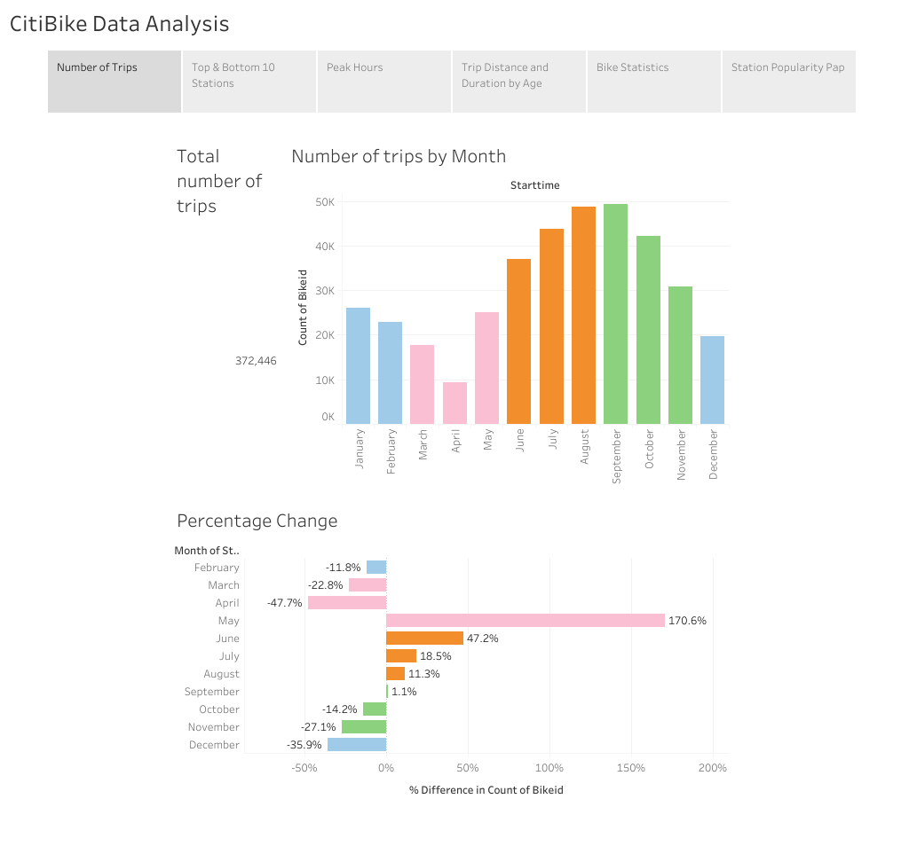
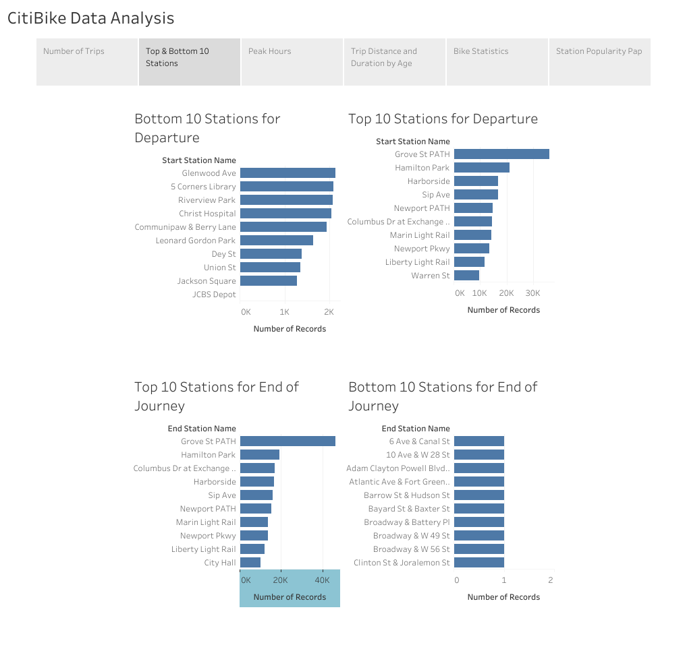
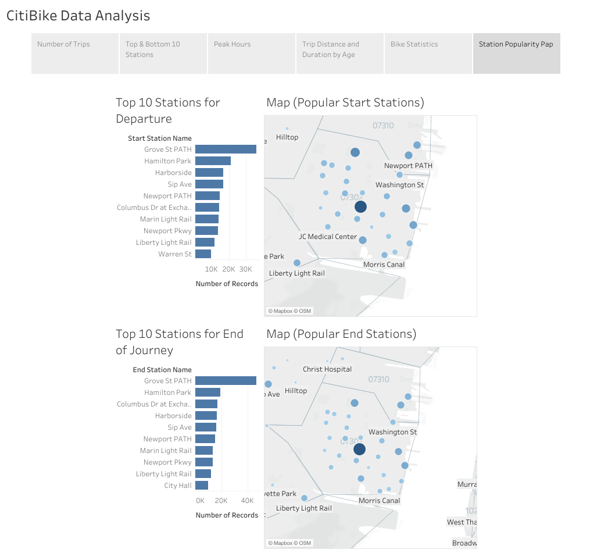
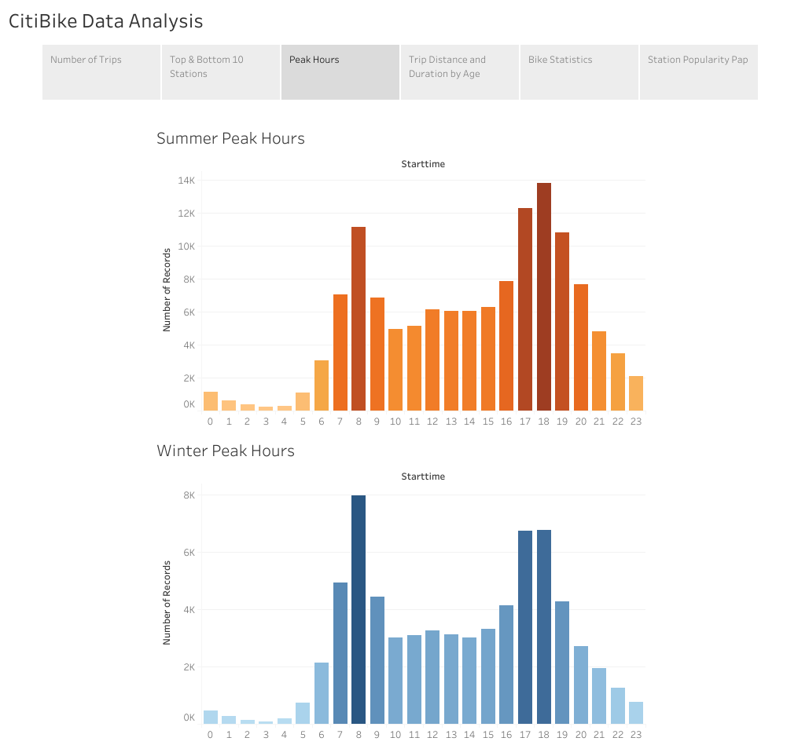
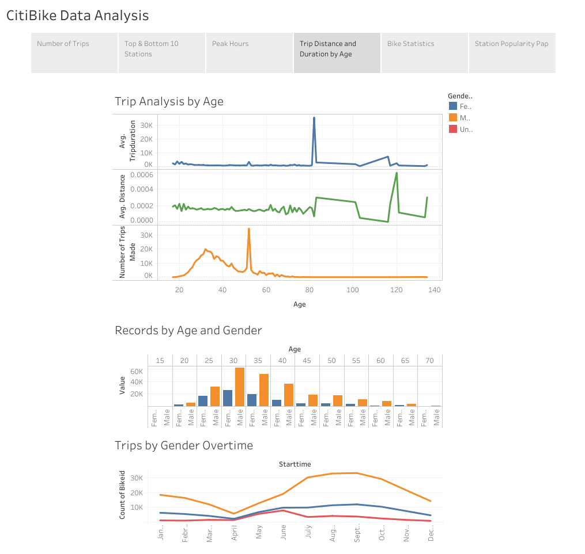

# Data Analysis with Tableau

## Introduction 

This repo explores the data provided by CitiBike, a bike ride-share program offered in New York City. I have analyzed a variety of questions which are all listed below. 

## Data 

Monthly CSV files (July 2019- June 2020) were collected from [Citi Bike Data webpage](https://www.citibikenyc.com/system-data).

# Visualization

[Tableau Public Visualization](https://public.tableau.com/profile/jessica.carmichael#!/vizhome/Citi_Bike_Analysis_16207568370770/Analysis?publish=yes)

## Analysis 

### 1. Total trips

There were a total of 372,446 number of trips made. The graph is color coded by season. We can clearly see a spike in usage during the warmer months and a decrease once the weather drops.

### 2. The 10 Top & Bottom Stations

### 3. The 10 Top Stations Visualization 

### 3. What are the peak hours?
We can clearly see that peak hours are concurrent with a standard 9 - 5 job. Peak hours in the morning is predominantly at 8 am; the peak resumes between 5 - 7 pm.

### 4. Trip Distance and Duration by Age

